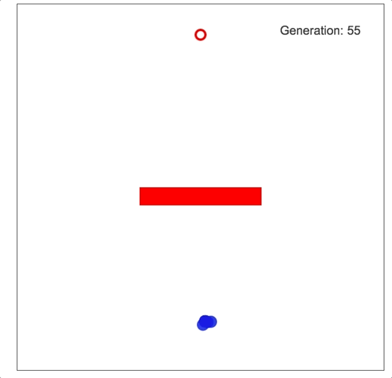

# Genetic Algorithm Demo

This is a genetic algorithm demo. There are 10 blue circles trying to reach a red target. Each small circle is initialized with a random array of force vectors. After 250 frames, the generation of circles ends. A new generation is then created by merging the arrays of the fittest circles from the previous generation. In this way, the circles learn to naviguate toward the target.

